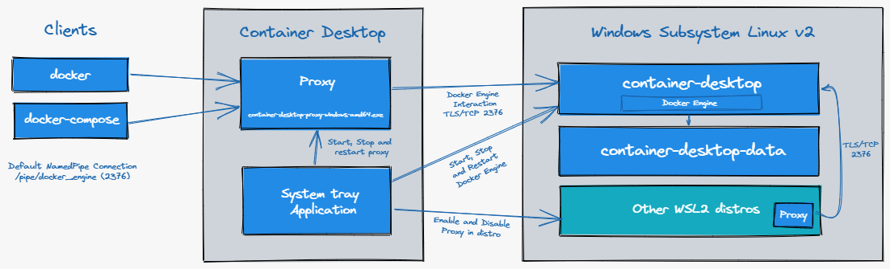

[](https://github.com/container-desktop/container-desktop/releases/latest)

# Container Desktop

Container Desktop is an open-source alternative to Docker Desktop. It enables you to build, push, pull and run Linux containers on Microsoft Windows, by providing a seamless integration with Docker Engine Community Edition running on Windows Subsystem for Linux. The Container Desktop bundles the open-source docker and docker-compose cli clients for a native and simple user experience.
## How it works?



Container Desktop Proxy handles the communication with the Docker Engine running in container-desktop distribution within Windows System Linux v2 (WSL2). The proxy enables native docker experience on Microsoft Windows, where it translates Windows Paths to WSL2 paths local to the container-desktop distribution.

With the Container Desktop System Tray Application you can manage the behavior of container-desktop. You can start, stop and restart the Container Desktop Proxy on the Windows Host or Enable or Disable a Docker Engine proxy in any available WSL2 distribution.
Container Desktop installs the docker and the docker-compose command line interface tools.

> Note: Container Desktop will not support Windows Containers.

## Supported features

* Run Docker daemon in its own distribution
* Use 'docker' and 'docker-compose' cli on Windows and enabled WSL2 Distributions to connect to the daemon. 
* You can use Windows paths as volumes, the container-desktop-proxy translates these paths to WSL2 paths local to the daemon distribution
* Start/stop/restart and quit Container Desktop by right clicking on the icon in the system tray.
* Enable container-desktop integration in installed WSL2 distributions.
* Use Port Forwarding to expose containers on a specific network. 
* Configure DNS Mode for Container Desktop (WLS2/Primary Network Adapter/Static).
## Installation

**System requirements**

Container Desktop requires WLS2 which is supported on these Windows versions:

* Microsoft Windows 10, Version 1903 with Build 18362.1049 or higher
* Microsoft Windows 10, Version 1909 with Build 18363.1049 or higher
* Microsoft Windows 10, Version 2004 or higher (20H2,21H1, 21H2, ..)
* Microsoft Windows 11, any version or build

**Installation Steps**

1. If you currently have docker-desktop installed, you need to **quit** *"Docker Desktop"*.
2. Download the latest [Release](https://github.com/container-desktop/container-desktop/releases)
3. (optional) Validate the file checksum  with the values in sha256sum.txt

    ```powershell
    Get-FileHash .\ContainerDesktopInstaller.exe -Algorithm SHA256
    ```

3. StartContainerDesktopInstaller.exe and click install to start the installation.

> Note: Windows Defender SmartScreen may pop-up and prevent StartContainerDesktopInstaller.exe from starting. When this is the case do the following: please select "More Info" and Select "Run Anyway".

## Build

**Pre-requisites**

* Microsoft Windows with Powershell
* [.NET 6 SDK](https://dotnet.microsoft.com/download/dotnet/6.0)
* Docker (either container-desktop or docker-for-desktop)

**Build**

1. Clone this repo 'git clone <https://github.com/container-desktop/container-desktop.git>'
2. Inside the container-desktop folder run '.\build.ps1'

## Credits

Container Desktop is made possible by using the following great projects:

* [Command Line Parser Library](https://github.com/commandlineparser/commandline)
* [Docker.DotNet](https://github.com/dotnet/Docker.DotNet)
* [Hardcodet NotifyIcon for WPF](https://github.com/hardcodet/wpf-notifyicon)
* [Managed DismApi Wrapper](https://github.com/jeffkl/ManagedDism)
* [ModernWPF UI Library](https://github.com/Kinnara/ModernWpf)
* [Nerdbank.GitVersioning](https://github.com/dotnet/Nerdbank.GitVersioning)
* [Newtonsoft.Json](https://www.newtonsoft.com/json)
* [P/Invoke](https://github.com/dotnet/pinvoke)
* [Serilog](https://serilog.net/)
* [System.IO.Abstractions](https://github.com/System-IO-Abstractions/System.IO.Abstractions)
* [System.Reactive](https://github.com/dotnet/reactive)
* [Docker CLI](https://github.com/docker/cli)
* [Docker Compose CLI](https://github.com/docker/compose-cli)
* [Docker Community Edition](https://github.com/docker/docker-ce)
