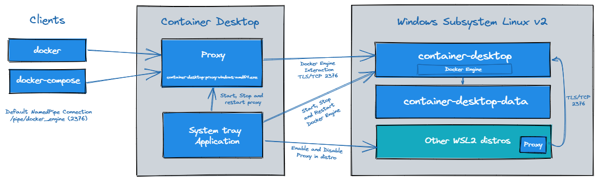

[](https://github.com/container-desktop/container-desktop/releases/latest)

# Container Desktop

Container Desktop is an open-source alternative to Docker Desktop. It enables you to build, push, pull, and run Linux containers on Microsoft Windows by providing seamless integration with Docker Engine Community Edition running on Windows Subsystem for Linux. Container Desktop bundles the open-source Docker and Docker Compose CLI clients for a native and simple user experience.

## How It Works



Container Desktop Proxy handles the communication with the Docker Engine running in the container-desktop distribution within Windows Subsystem for Linux v2 (WSL2). The proxy enables a native Docker experience on Microsoft Windows by translating Windows paths to WSL2 paths local to the container-desktop distribution.

With the Container Desktop system tray application you can manage the behavior of Container Desktop. You can start, stop, and restart the Container Desktop Proxy on the Windows host, or enable or disable a Docker Engine proxy in any available WSL2 distribution. Container Desktop installs the Docker CLI and Docker Compose command-line tools.

> **Note:** Container Desktop does not support Windows Containers.

## Supported Features

- Run the Docker daemon in its own WSL2 distribution.
- Use `docker` and `docker-compose` on Windows and enabled WSL2 distributions to connect to the daemon.
- Use Windows paths as volumes — the Container Desktop Proxy translates them to WSL2 paths local to the daemon distribution.
- Start, stop, restart, and quit Container Desktop from the system tray icon.
- Enable Container Desktop integration in installed WSL2 distributions.
- Use Port Forwarding to expose containers on a specific network interface.
- Configure the DNS mode (WSL2 / Primary Network Adapter / Static).

## Installation

### System Requirements

Container Desktop requires WSL2, which is supported on these Windows versions:

- Microsoft Windows 10, Version 1903 with Build 18362.1049 or higher
- Microsoft Windows 10, Version 1909 with Build 18363.1049 or higher
- Microsoft Windows 10, Version 2004 or higher (20H2, 21H1, 21H2, …)
- Microsoft Windows 11, any version or build

### Installation Steps

1. If you currently have Docker Desktop installed, **quit Docker Desktop** first.
2. Download the latest [ContainerDesktopInstaller.exe](https://github.com/container-desktop/container-desktop/releases/latest) from GitHub Releases.
3. Optionally, validate the file checksum against the values in sha256sum.txt:

    ```powershell
    Get-FileHash .\ContainerDesktopInstaller.exe -Algorithm SHA256
    ```

4. Double-click **ContainerDesktopInstaller.exe** and click **Install** to start the installation.

> **Note:** Windows Defender SmartScreen may pop up and prevent ContainerDesktopInstaller.exe from starting. When this happens, select **More Info** and then **Run Anyway**.

For full installation details, upgrade, and uninstall instructions, see the [Installation Guide](docs/guides/installation.md).

## Build from Source

### Prerequisites

- Microsoft Windows with PowerShell
- [.NET 8 SDK](https://dotnet.microsoft.com/download/dotnet/8.0)
- Docker (either Container Desktop or Docker Desktop)

### Steps

1. Clone this repository:

    ```powershell
    git clone https://github.com/container-desktop/container-desktop.git
    ```

2. Inside the `container-desktop` folder, run:

    ```powershell
    .\build.ps1
    ```

## Credits

Container Desktop is made possible by the following open-source projects:

- [Command Line Parser Library](https://github.com/commandlineparser/commandline)
- [Docker.DotNet](https://github.com/dotnet/Docker.DotNet)
- [Hardcodet NotifyIcon for WPF](https://github.com/hardcodet/wpf-notifyicon)
- [Managed DismApi Wrapper](https://github.com/jeffkl/ManagedDism)
- [ModernWPF UI Library](https://github.com/Kinnara/ModernWpf)
- [Nerdbank.GitVersioning](https://github.com/dotnet/Nerdbank.GitVersioning)
- [Json.NET](https://www.newtonsoft.com/json)
- [P/Invoke](https://github.com/dotnet/pinvoke)
- [Serilog](https://serilog.net/)
- [System.IO.Abstractions](https://github.com/System-IO-Abstractions/System.IO.Abstractions)
- [Reactive Extensions](https://github.com/dotnet/reactive)
- [CompareNetObjects](https://github.com/GregFinzer/Compare-Net-Objects)
- [AvalonEdit](https://github.com/icsharpcode/AvalonEdit)
- [NuGet.Versioning](https://github.com/NuGet/Home)
- [Docker CLI](https://github.com/docker/cli)
- [Docker Compose CLI](https://github.com/docker/compose-cli)
- [The Moby Project](https://github.com/moby/moby)
- [go-dnsmasq](https://github.com/janeczku/go-dnsmasq)
