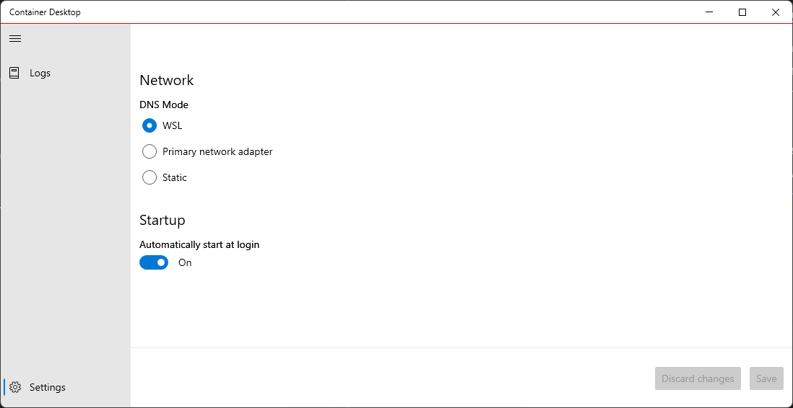

# DNS Mode Configuration

This page contains information on how to view and change the DNS settings for Container Desktop. By default, WSL2 automatically sets the IP address of the virtual Ethernet adapter of the host in `/etc/resolv.conf`. The `resolv.conf` file contains a list of DNS servers used by the Container Desktop Docker engine to resolve hostnames.

Container Desktop lets you deviate from the standard WSL2 DNS behavior by using the DNS servers of the primary network adapter (which updates automatically when DNS addresses change), or by manually specifying one or more DNS server addresses.

This option exists primarily because the stability and correct operation of the standard WSL2 DNS configuration cannot be guaranteed in all environments (see [open DNS issues reported on WSL2](https://github.com/microsoft/WSL/issues?q=is%3Aissue+is%3Aopen+DNS)).

You can configure the DNS mode via the system tray application by selecting the **Settings** option. Under the **Network** section you will find the three available DNS modes. Select a mode and click **Save** to apply the new DNS configuration.



> **Note:** You can review DNS mode changes using the **View log stream** option.

## Examples for Unattended Installations

The unattended installation option provides a convenient way to install without manual intervention. DNS mode can be configured during unattended installation. See the following examples:

### DNS Mode: Primary Network Adapter

```powershell
.\ContainerDesktopInstaller.exe install --unattended --settings DnsMode=Auto
```

### DNS Mode: Static

With static mode you can specify multiple name servers as a comma-separated list.

```powershell
.\ContainerDesktopInstaller.exe install --unattended --settings DnsMode=Static DnsAddresses=1.0.0.1,8.8.8.8
```

### DNS Mode: WSL

WSL is the default DNS mode (this setting is optional and explicit).

```powershell
.\ContainerDesktopInstaller.exe install --unattended --settings DnsMode=Wsl
```
