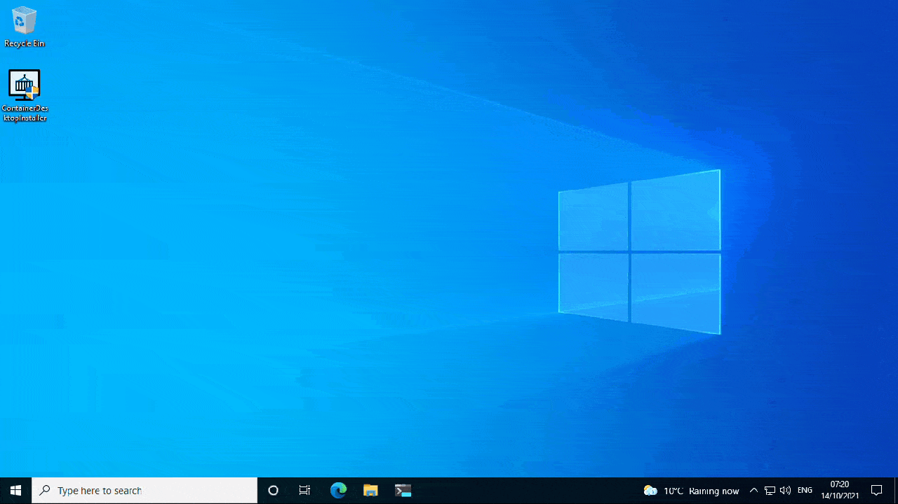

# Install Container Desktop

This page contains information about system requirements and instructions to install, update, and uninstall Container Desktop.

## Overview



## System Requirements

Container Desktop requires WSL2, which is supported on these Windows versions:

- Microsoft Windows 10, Version 1903 with Build 18362.1049 or higher
- Microsoft Windows 10, Version 1909 with Build 18363.1049 or higher
- Microsoft Windows 10, Version 2004 or higher (20H2, 21H1, 21H2, …)
- Microsoft Windows 11, any version or build

WSL2 requires Virtualization Extensions (Intel VT-x/EPT or AMD-V) to be enabled in the BIOS of the physical machine, or in your virtual machine configuration. More details on how to enable Virtualization Extensions for popular Windows desktop virtualization products:

- [Hyper-V](https://docs.microsoft.com/en-us/virtualization/hyper-v-on-windows/user-guide/nested-virtualization)
- [VirtualBox](https://docs.oracle.com/en/virtualization/virtualbox/6.0/admin/nested-virt.html)
- [VMware Workstation](https://docs.vmware.com/en/VMware-Workstation-Pro/16.0/com.vmware.ws.using.doc/GUID-3140DF1F-A105-4EED-B9E8-D99B3D3F0447.html)

If you currently have Docker Desktop installed, you need to either _quit_ **Docker Desktop** if you want to try out Container Desktop, or _uninstall_ **Docker Desktop** if you are convinced that **Container Desktop** is a suitable replacement. Container Desktop can be installed alongside Docker Desktop, but both cannot be active at the same time, as they share the same named-pipe interface for clients to connect to (the Docker CLI and Docker Compose CLI).

## Install and Run Container Desktop

1. Download the latest [ContainerDesktopInstaller](https://github.com/container-desktop/container-desktop/releases/latest) from GitHub Releases. Optionally, you can validate the file checksum against the values in sha256sum.txt with the following PowerShell command:
    ```powershell
    Get-FileHash .\ContainerDesktopInstaller.exe -Algorithm SHA256
    ```
2. Double-click **ContainerDesktopInstaller.exe** to run the installer.
3. User Account Control will prompt you to approve the installation — select **Yes**.
4. Select your installation options. By default the following options are selected: _Create Start Menu Shortcut_, _Start application when Windows starts_, and _Run application after installation finished_.
5. Select **Install** to start the installation.

> **Note:** Windows Defender SmartScreen may pop up and prevent ContainerDesktopInstaller.exe from starting. When this happens, select **More Info** and then **Run Anyway**.

## Unattended Installation

The unattended installation option provides a convenient way to install without manual intervention. An unattended installation can be performed with the following command-line option:

```powershell
ContainerDesktopInstaller.exe install --unattended
```

> **Unattended DNS mode settings:** To configure the DNS mode during unattended installation, see [DNS Mode Examples for Unattended Installations](dns-mode-configuration.md).

## Upgrade Container Desktop

If a new version of Container Desktop is available, run the [new installer](https://github.com/container-desktop/container-desktop/releases/latest) (ContainerDesktopInstaller.exe) to upgrade the current installation.

## Uninstall Container Desktop

> **Important:** Uninstalling Container Desktop will remove the container-desktop-data WSL2 distribution. This will destroy all Docker containers, images, and volumes, and remove any files generated by containers or applications on the local machine. If you want to upgrade to a newer version, run the installer instead of uninstalling — you will not lose any data.

To uninstall Container Desktop:

1. From the Windows Start menu, select **Settings > Apps > Apps & features** (or search for **Add or Remove Programs**).
2. Select **Container Desktop** from the app list, then select **Uninstall**.
3. Click **Uninstall** to confirm.

Container Desktop can also be uninstalled from the command line. When installed, the installer is available at `C:\Program Files\ContainerDesktop\`:

```powershell
ContainerDesktopInstaller.exe uninstall
```

You will be prompted to confirm the uninstallation. Add `--quiet` to skip the confirmation prompt:

```powershell
ContainerDesktopInstaller.exe uninstall --quiet
```

> **Note:** When the above command is run in a PowerShell session, you will be prompted by User Account Control. Uninstalling Container Desktop requires elevated permissions.
