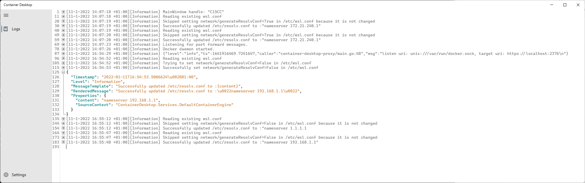

# View Installation Log and Diagnose Run-Time Behavior

This page contains information on how to view installation log events and how to diagnose run-time behavior of Container Desktop.

## View Installation Log Events

Container Desktop uses Windows Event Log to record errors and events during installation. Use the following steps to access the logs with Windows Event Viewer.

1. Open a command prompt or use the search box in your taskbar.
2. Type `eventvwr` and press Enter.
3. Expand **Windows Logs** and select **Application** logs.
4. Filter for Container Desktop related events by selecting **Filter Current Log…**
5. Select Event sources **Container Desktop** and **Container Desktop Installer**, then click **OK**.
6. Only Container Desktop related events are now shown.

## Diagnose Run-Time Behavior

Container Desktop provides a log stream to help diagnose run-time behavior. You can access the log stream via the system tray application by selecting **View log stream**. All run-time events are logged in structured JSON format.

