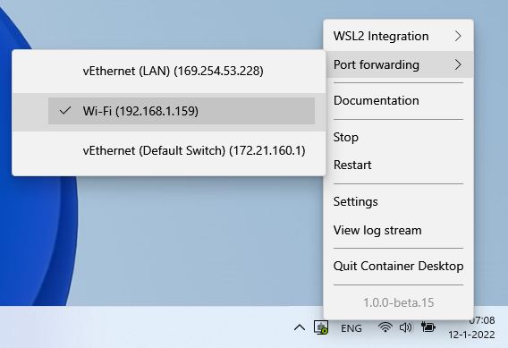

# Port Forwarding

This page contains information on how to expose containers to an external network using port forwarding.

## Port Forwarding Feature

Container Desktop provides a feature to expose containers on a specific network. By default, containers are only accessible on localhost. With the **Port Forwarding** feature you can bind container ports to a specific network interface, allowing other machines on the same network to access those containers. You will also need to configure the Windows Firewall to allow inbound traffic.

## Example Scenario

In this example we will publish an nginx container on HTTP port 80 on an external network interface. The example contains the following steps:

1. Run an nginx container on port 80.
2. Enable Port Forwarding in Container Desktop.
3. Configure the Windows Firewall.

### Run Nginx on Port 80

Run an nginx container with the `-p` argument to publish it on port 80:

```
docker run -p 80:80 -d nginx
```

> **Note:** The first part of the `-p` value is the port on the host; the part after `:` is the port on the container. If the port is already in use, choose a different host port.

Open your browser and navigate to `http://localhost`. The default "Welcome to nginx!" page should appear.

### Enable Port Forwarding

Select the **Port Forwarding** option in the Container Desktop system tray application, then select the network interface you want to forward container ports to:



Container Desktop will bind the selected adapter to listen on the published container ports.

> **Note:** All published ports are exposed on the chosen network interface. Be aware of which containers you are exposing to your external network.

### Configure the Firewall

To allow external connections, open the Windows Firewall to accept inbound traffic on the used ports.

1. Open PowerShell with administrator privileges.
2. Create a new firewall inbound rule to accept traffic on port 80:

```powershell
New-NetFirewallRule -DisplayName "Container-Desktop-Example" -Direction Inbound -Profile Private -Protocol TCP -LocalPort 80
```

> **Note:** This example uses the **Private** firewall profile. Depending on your network, you may need to specify a different profile (Domain or Public).

Open a browser on a different machine connected to the same network and navigate to `http://<external-ip-address>`. The default "Welcome to nginx!" page should appear.

## Clean Up

After completing the example, remove the example configuration.

### Remove the Firewall Rule

1. Open PowerShell with administrator privileges.
2. Remove the example firewall rule:

```powershell
Remove-NetFirewallRule -DisplayName "Container-Desktop-Example"
```

### Disable Port Forwarding

Disable port forwarding in Container Desktop by deselecting the interface in the **Port Forwarding** option of the system tray application.
