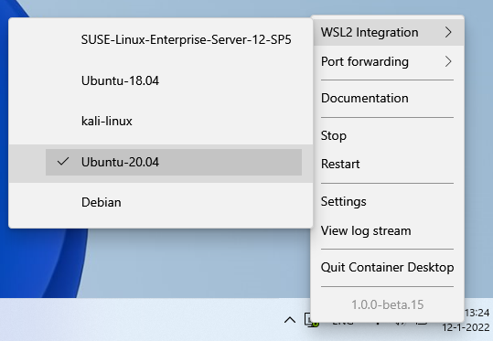

# WSL2 Distro Integration

This page contains information on how to configure Container Desktop integration with other WSL2 distributions.

In Container Desktop, select an installed WSL2 distribution for which you want to enable Docker integration by navigating to: **Settings > Resources > WSL2 Integration**.

To confirm that Container Desktop has been enabled in the WSL2 distribution, open a terminal in that distribution (e.g. Ubuntu) and verify that Docker CLI commands are available by running `docker --version` or `docker-compose`. You can then list running containers with `docker ps` — this shows the same containers as those running on the host.
